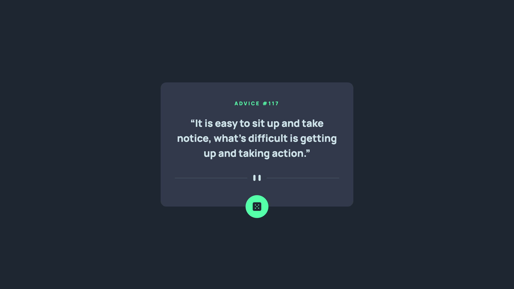

# Frontend Mentor - Advice generator app solution

This is a solution to the [Advice generator app challenge on Frontend Mentor](https://www.frontendmentor.io/challenges/advice-generator-app-QdUG-13db). Frontend Mentor challenges help you improve your coding skills by building realistic projects.

## Table of contents

- [Overview](#overview)
  - [The challenge](#the-challenge)
  - [Screenshot](#screenshot)
  - [Links](#links)
- [My process](#my-process)
  - [Built with](#built-with)
  - [What I learned](#what-i-learned)
  - [Continued development](#continued-development)
  - [Useful resources](#useful-resources)
- [Author](#author)
- [Acknowledgments](#acknowledgments)

## Overview

This was a project that can easily be done quicly but is great for a quick introduction to the fetch api. It is desktop and mobile friendly. I took a desktop first approach and then adapted it to mobile. No frameworks or libraries just used regular HTML, CSS and JS. I did use SCSS to make the styling a little easier.

### The challenge

Users should be able to:

- View the optimal layout for the app depending on their device's screen size
- See hover states for all interactive elements on the page
- Generate a new piece of advice by clicking the dice icon

### Screenshot



You can see other screenshots in the screenshot folder.

### Links

- Solution URL: [Github Repo](https://github.com/calebmcmains/fm-advice-generator)
- Live Site URL: [Github Page](https://calebmcmains.github.io/fm-advice-generator/)

## My process

Pretty simple. Made my own figma file to make styling and variables easier. Then went after it on the HTML and CSS. Ending with the Javascript to fetch the advice.

### Built with

- Semantic HTML5 markup
- CSS custom properties
- SCSS variables
- Vanilla JS
- Flexbox
- Desktop-first workflow
- [SCSS](https://sass-lang.com) - CSS Preprocessor

### What I learned

I learned a couple things. I was able to add the divided image that was provided as content to a div, that made changing images at certain screen sizes easy!
I also learned about writting CSS specific to if your device can hover or not.

```html
<div class="divider-img"></div>
```

```css
.divider-img {
  content: url();
}
```

```css
/* this allows you to choose what happens with your css whether there is the ability to hover or not */
/* I used this to solve an issue where my hover affect would stay after click the dice on a moible device */
@media (hover: hover) {
  /* what happens when hover is possible */
}
/* and */
@media (hover: none) {
  /* what happens when hover is not possible */
}
```

### Continued development

I'd live to keep get well versed in standard CSS practices. I was still having to google pretty basic stuff like centering the whole container on the screen. This will come with time and practice though!

### Useful resources

- [Google](https://www.google.com) - I'm serious...don't hesitate to google things....but please work on being GOOD and googling. There is a difference.
- [Kevin Powell's | "Dealing wiht hover on mobile"](https://www.youtube.com/watch?v=uuluAyw9AI0) - This was a great resource for figuring out how to deal with hover affects on mobile devices.

## Author

- Website - [Caleb McMains](https://www.calebmcmains.com)
- Frontend Mentor - [@calebmcmains](https://www.frontendmentor.io/profile/calebmcmains)

## Acknowledgments

Shout out to Kevin Powell, great CSS content
[Kevin Powell's YouTube](https://www.youtube.com/@KevinPowell)
